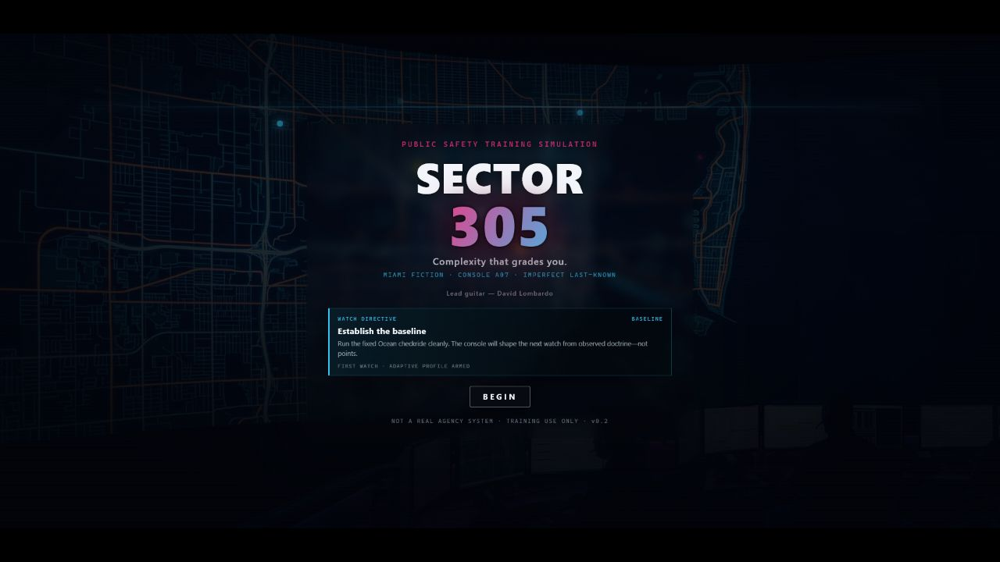
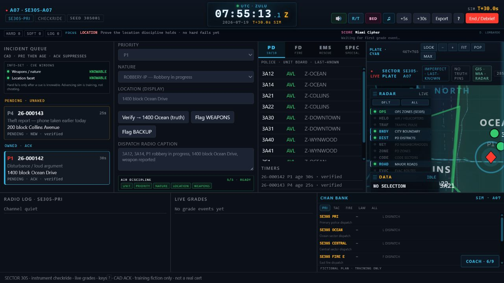
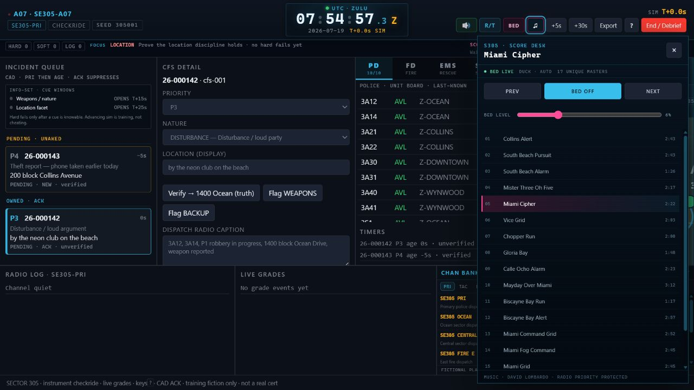
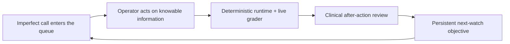
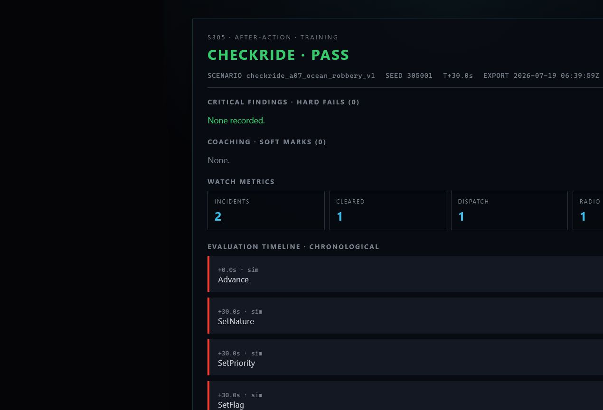
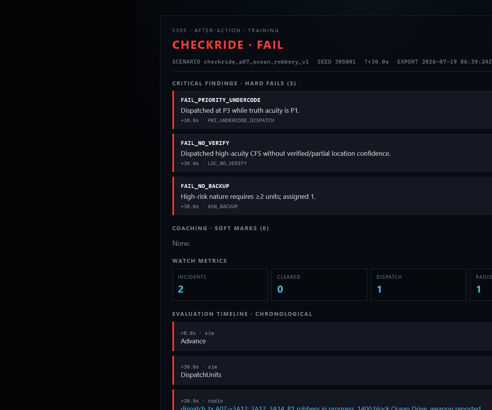

<p align="center">
  
</p>

<h1 align="center">SECTOR 305</h1>

<p align="center">
  <strong>Miami on the map. Console on the glass.</strong><br />
  A doctrine-driven fictional PSAP dispatch simulator where process—not spectacle—decides the watch.
</p>

<p align="center">
  <a href="https://github.com/coldbricks/SECTOR-305/actions/workflows/ci.yml"></a>
  
  
  
</p>

> **South Beach swagger at the door. A ruthless instrument on the glass.**

## What the hell is this?

SECTOR 305 is a deterministic emergency-communications training simulation set inside a fictional Miami-area public-safety answering point. You work the A-console: own the queue, verify imperfect locations, classify priority, build the response, protect airtime, obtain readbacks, maintain unit status, and leave a defensible record.

The simulation does not grade whether the story had a heroic ending. It grades whether your process held together under pressure.

This is not an arcade city-management game, a production CAD, or an official certification product. It is a deep fictional training instrument built to make operational discipline playable.

## The glass

<p align="center">
  
</p>

The console puts the full watch in one coherent instrument:

- Priority-and-age incident queue with imperfect information
- CFS classification, location confidence, safety flags, and radio composition
- Police, fire, EMS, air, hospital, and special-use presentation boards
- Last-known unit tracks over a layered Miami GIS sector plate
- Fictional built-in channel bank with a clean local-adapter seam
- Live hard-fail and coaching feedback
- Keyboard-complete checkride path
- Original title music featuring David Lombardo on lead guitar
- Seventeen-track original scenario score with automatic radio ducking
- Dedicated score desk: on/off, previous/next, direct track selection, and bed level

## Music that knows when to get out of the way

<p align="center">
  
</p>

The title performance crosses into a rotating watch score when the console
opens. Seventeen original David Lombardo tracks are leveled for background use,
looped per watch, and automatically ducked beneath dispatch and unit traffic.
The score desk exposes the whole catalog without mixing music controls into the
radio path.

## The loop that remembers

SECTOR 305 carries performance forward without points, streak bait, or fake credentials. Every completed watch updates a local mastery record. Doctrine findings become operational domains—location, priority, assignment, status, radio, tempo, documentation, safety, multi-call awareness, and information constraints.

The next launch arrives with one explicit objective:

```text
WATCH DIRECTIVE · LOCATION
Verify before you launch.
```

A clean follow-up watch does not erase the lesson. It converts the objective into retention: prove that the discipline still holds under pressure.



## Pass clean—or learn exactly why you did not

<table>
  <tr>
    <td width="50%"></td>
    <td width="50%"></td>
  </tr>
  <tr>
    <td align="center"><strong>Qualified</strong><br />Zero hard fails. The next watch asks you to hold the standard.</td>
    <td align="center"><strong>Corrective</strong><br />Evidence-backed failures become the next watch's operating focus.</td>
  </tr>
</table>

## Why it hits differently

| System | What it means in the watch |
|---|---|
| Deterministic simulation kernel | The same seed and command stream reproduce the same evaluation. |
| Information-set fairness | Hidden scenario truth cannot grade you until the relevant cue becomes knowable. |
| Doctrine packs | Priority, statuses, assignment, radio, location, and rubric law are data-driven. |
| Sacred replay artifact | A `SessionRecord` stores commands; the engine re-derives state and the debrief. |
| Adaptive mastery | Persistent findings shape the next objective without turning performance into points. |
| Restrained presentation | Neon belongs to the shell. The live CAD uses EFIS-like semantic color. |
| Authentic texture | City GIS atmosphere, imperfect last-known mapping, fictional channels, and an original Miami score ground the fiction. |

## Architecture

```text
packs/*                       fictional doctrine and rubric data
        ↓
packages/core                pure TypeScript runtime · no DOM · seeded clock
        ↓
PlayerCommand → SectorState → GradeEvent → Debrief
        ↓                         ↓
packages/web                 SessionRecord replay + adaptive mastery
React console · GIS plate · audio director · Playwright acceptance
```

The core rule is simple: replaying a `SessionRecord` headlessly must reproduce the same hard-fail multiset as the UI session.

## Run the watch

Requirements: Node.js 20 or newer.

```bash
git clone https://github.com/coldbricks/SECTOR-305.git
cd SECTOR-305
npm install
npm run dev
```

Open [http://127.0.0.1:3050](http://127.0.0.1:3050), let the title track breathe, then select **BEGIN**.

Useful commands:

```bash
npm test                  # core invariants and doctrine behavior
npm run test:e2e          # full browser acceptance
npm run typecheck         # strict TypeScript
npm run build             # production build
npm run validate:packs    # doctrine-pack validation
npm run sim -- fail       # intentional five-finding checkride
npm run sim -- pass       # clean canonical checkride
```

## Verification posture

Current local milestone:

- 107 core assertions across 17 test files
- 10 end-to-end browser scenarios
- Deterministic pass/fail simulation demos
- Pack validation covering 14 natures and 24 rubric rules
- Responsive acceptance at 1471px, 1280×720, and 760px
- Native keyboard controls, focus visibility, reduced-motion support, and protected radio intelligibility

CI repeats typechecking, core tests, production build, pack validation, both simulations, and Playwright acceptance.

## Data, audio, and attribution

- Geographic atmosphere is curated from [City of Miami GIS Open Data](https://datahub-miamigis.opendata.arcgis.com/) and remains explicitly non-operational.
- SE305 zones, units, incidents, doctrine, and scenario truth are fictional training content.
- The public channel bank is independently authored fictional training data. Premium third-party radio exports are absent from the public history.
- Original music: **“Dispatch in Miami”** plus seventeen unique scenario-score masters by David Lombardo.
- Audio is copyright © 2026 David Lombardo, all rights reserved, and is separate from the source-code license.

See [THIRD_PARTY_NOTICES.md](THIRD_PARTY_NOTICES.md) for the publication boundary.

## Safety and honesty

SECTOR 305 is a fictional training simulation. It is not affiliated with the City of Miami, Miami-Dade County, any PSAP, RadioReference, APCO, NENA, or IAED. It is not a substitute for agency policy, supervised training, or production dispatch software. Completing an in-product track grants no real credential.

## Read deeper

- [Product brief](docs/BRIEF.md)
- [Architecture](docs/ARCHITECTURE.md)
- [Doctrine](docs/DOCTRINE.md)
- [Rubric](docs/RUBRIC.md)
- [Content policy](docs/CONTENT_POLICY.md)
- [Adversarial design review](docs/ADVERSARIAL_VOLLEY.md)
- [Product roadmap](docs/FULL_PRODUCT_ROADMAP.md)

## Contributing

The highest-value contribution is adversarial operational review. If a grade is unfair, a doctrine rule is incoherent, or the console teaches the wrong habit, open an issue with reproducible evidence and the relevant scenario clock.

See [CONTRIBUTING.md](CONTRIBUTING.md) before submitting changes.

## License

Source code and original documentation are available under the [MIT License](LICENSE). Music remains copyright © 2026 David Lombardo, all rights reserved; see [THIRD_PARTY_NOTICES.md](THIRD_PARTY_NOTICES.md).
