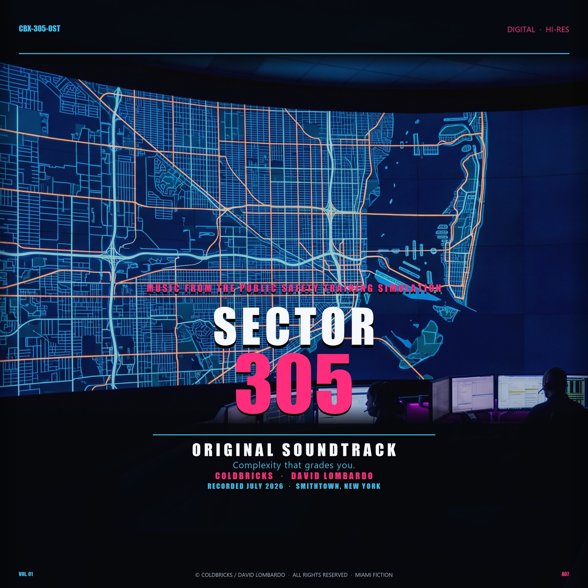

<p align="center">
  
</p>

<h1 align="center">SECTOR 305</h1>

<p align="center">
  <strong>Miami on the map. Console on the glass.</strong><br />
  A doctrine-driven fictional PSAP dispatch simulator where process—not spectacle—decides the watch.
</p>

<p align="center">
  <a href="https://github.com/coldbricks/SECTOR-305/actions/workflows/ci.yml"></a>
  
  
  
</p>

<p align="center">
  <a href="#run-the-watch">Run</a>
  &nbsp;·&nbsp;
  <a href="#original-soundtrack">Soundtrack</a>
  &nbsp;·&nbsp;
  <a href="#read-deeper">Docs</a>
</p>

<p align="center">
  <em>Original score by David Lombardo —</em>
  <a href="https://coldbricks.github.io/SECTOR-305/ost/">listen in browser</a>
</p>

> **South Beach swagger at the door. A ruthless instrument on the glass.**

## What this is

You work a fictional Miami-area A-console: own the queue, verify imperfect locations, classify priority, build the response, protect airtime, obtain readbacks, maintain unit status, and leave a defensible record.

It does **not** grade whether the story ended heroically. It grades whether your **process** held under pressure.

Not an arcade city builder. Not production CAD. Not an official certification product. A deep training instrument that makes operational discipline playable.

## The glass

One coherent instrument for the full watch:

| Surface | What you get |
|---|---|
| Incident queue | Priority + age, imperfect information |
| CFS / response | Classification, location confidence, safety flags, radio composition |
| Boards | Police, fire, EMS, air, hospital, special-use |
| Sector plate | Last-known tracks over layered Miami GIS atmosphere |
| Radio | Fictional channel bank + local-adapter seam |
| Grader | Live hard-fail and coaching feedback |
| Input | Keyboard-complete checkride path |
| Score | Title track + 17 scenario beds with radio ducking and a dedicated [score desk](https://coldbricks.github.io/SECTOR-305/ost/) |

<p align="center">
  
  <a href="https://coldbricks.github.io/SECTOR-305/ost/"></a>
</p>

## The loop that remembers

No points theater. No fake credentials. Each completed watch updates local mastery across operational domains (location, priority, assignment, status, radio, tempo, documentation, safety, multi-call, information constraints). The next launch opens with one explicit objective:

```text
WATCH DIRECTIVE · LOCATION
Verify before you launch.
```

A clean follow-up does not erase the lesson — it asks you to **hold** the standard under pressure.

<table>
  <tr>
    <td width="50%"></td>
    <td width="50%"></td>
  </tr>
  <tr>
    <td align="center"><strong>Qualified</strong><br />Zero hard fails. Next watch: hold the standard.</td>
    <td align="center"><strong>Corrective</strong><br />Evidence-backed failures become the next focus.</td>
  </tr>
</table>

## Original soundtrack

<p align="center">
  <a href="https://coldbricks.github.io/SECTOR-305/ost/">
    
  </a>
</p>

<p align="center">
  Coldbricks · David Lombardo<br />
  Recorded July 2026 · Smithtown, New York<br />
  <a href="https://coldbricks.github.io/SECTOR-305/ost/">Title theme and seventeen scenario beds →</a>
</p>

In-sim: title performance on the shell, then a rotating watch bed that ducks under dispatch and unit traffic. Score desk handles on/off, prev/next, direct select, and bed level — music never owns the radio path.

## Run the watch

Node.js **20+**.

```bash
git clone https://github.com/coldbricks/SECTOR-305.git
cd SECTOR-305
npm install
npm run dev
```

Open [http://127.0.0.1:3050](http://127.0.0.1:3050) → let the title track breathe → **BEGIN**.

```bash
npm test                  # core invariants + doctrine
npm run test:e2e          # browser acceptance
npm run typecheck
npm run build
npm run validate:packs
npm run sim -- fail       # intentional five-finding checkride
npm run sim -- pass       # clean canonical checkride
```

## Why it hits differently

| System | In the watch |
|---|---|
| Deterministic kernel | Same seed + command stream → same evaluation |
| Information-set fairness | Hidden truth cannot grade you until the cue is knowable |
| Doctrine packs | Priority, status, assignment, radio, location, rubric as data |
| Sacred `SessionRecord` | Commands stored; engine re-derives state and debrief |
| Adaptive mastery | Findings shape the next objective — not a scoreboard |
| Restrained glass | Neon is shell. Live CAD stays EFIS/semantic |
| Texture | Miami GIS atmosphere, imperfect last-known, fictional channels, original score |

## Architecture

```text
packs/*                 fictional doctrine + rubric data
        ↓
packages/core           pure TS runtime · no DOM · seeded clock
        ↓
PlayerCommand → SectorState → GradeEvent → Debrief
        ↓                         ↓
packages/web            SessionRecord replay + adaptive mastery
React console · GIS · audio director · Playwright
```

Replaying a `SessionRecord` headlessly must reproduce the same hard-fail multiset as the UI session.

## Verification

- Core assertions + doctrine pack validation (natures + rubric rules)
- Playwright acceptance (including responsive widths)
- Deterministic pass/fail simulation demos
- Keyboard path, focus visibility, reduced-motion, radio intelligibility protected

CI runs typecheck, core tests, production build, pack validation, both sims, and e2e.

## Data, audio, and attribution

- Geographic atmosphere from [City of Miami GIS Open Data](https://datahub-miamigis.opendata.arcgis.com/) — non-operational.
- Zones, units, incidents, doctrine, and scenario truth are **fictional**.
- Public channel bank is independently authored training fiction.
- Music: **“Dispatch in Miami”** + seventeen scenario masters by **David Lombardo** · © 2026, all rights reserved (separate from source license).

See [THIRD_PARTY_NOTICES.md](THIRD_PARTY_NOTICES.md).

## Safety and honesty

SECTOR 305 is a fictional training simulation. Not affiliated with the City of Miami, Miami-Dade County, any PSAP, RadioReference, APCO, NENA, or IAED. Not a substitute for agency policy, supervised training, or production dispatch software. Completing an in-product track grants **no** real credential.

## Read deeper

- [Product brief](docs/BRIEF.md)
- [Architecture](docs/ARCHITECTURE.md)
- [Doctrine](docs/DOCTRINE.md)
- [Rubric](docs/RUBRIC.md)
- [Content policy](docs/CONTENT_POLICY.md)
- [Adversarial design review](docs/ADVERSARIAL_VOLLEY.md)
- [Product roadmap](docs/FULL_PRODUCT_ROADMAP.md)

## Contributing

Highest-value work: adversarial operational review. Unfair grade, incoherent doctrine, or a console habit that teaches wrong — open an issue with reproducible evidence and scenario clock.

See [CONTRIBUTING.md](CONTRIBUTING.md).

## License

Source and original documentation: [MIT](LICENSE).  
Music: © 2026 David Lombardo, all rights reserved — [THIRD_PARTY_NOTICES.md](THIRD_PARTY_NOTICES.md).
